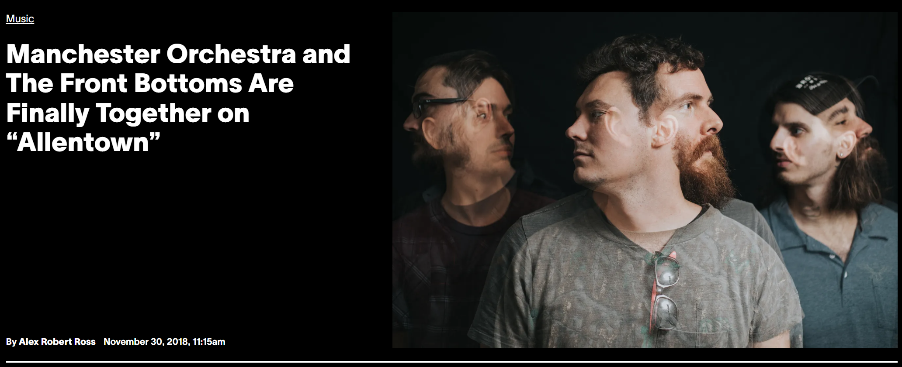

# Why This Data Set Matters

```{r}
#| echo: false

default_chunk_hook  <- knitr::knit_hooks$get("chunk")

latex_font_size <- c("Huge", "huge", "LARGE", "Large", 
                     "large", "normalsize", "small", 
                     "footnotesize", "scriptsize", "tiny")

knitr::knit_hooks$set(chunk = function(x, options) {
  x <- default_chunk_hook(x, options)
  if(options$size %in% latex_font_size) {
    paste0("\n \\", options$size, "\n\n", 
      x, 
      "\n\n \\normalsize"
    )
  } else {
    x
  }
})

```

-   Hard to find real world data sets for teaching at a variety of levels

-   Students rarely see data that must be created (not downloaded)

-   Realistic messiness: missing values, duplicates, inconsistent metadata

-   Single data set that supports intro $\rightarrow$ advanced courses

-   Allows students to track progress

-   Multiple models: logistic, multinomial, LASSO, trees


# Our Application 
{width="100%"}

\tiny
**Source:** @Noisey

# Motivating Questions 
* Three bands collaborated to produce a single track, "Allentown" 
*   Can we use statistics and data science to determine:

    *  which band the **sound** most resembles?

    *   which band the **lyrics** most resemble?

# The Problem (And The Opportunity!)

**Problem**

-   We need a data set with:

    -   information about the sound qualities and lyrics of the combined track

    -   information about the sound qualities and lyrics for all tracks

-   No such data set exists

**Opportunity**

-   We create activities to show students at a variety of levels how to:
    -   create the needed data
    -   clean and process it
    -   use modeling to answer the research questions

# Learning Goals For Students

-   Identify ethical constraints in data collection

-   Create features from raw media (sound, lyrics from text)

-   Clean/merge

-   Fit/interpret logistic and multinomial models

-   Communicate results to a general audience

# Where We Teach

Will 

- Colgate University: small liberal arts college 
- Courses used: undergraduate Data Analysis 
- Students per class: 30 or less 

Roy

- Furman University: small liberal arts college 
- Courses used: undergraduate Statistical Methods
- Students per class: 24 or less 

Nicole and Ciaran

- Wake Forest University : medium-sized liberal arts university
- Courses used: graduate GLMs, undergraduate Text Analysis
- Students per class: 30 or less 

# What We Have: Tracks

* **The Front Bottoms Releases (61 tracks):** The Front Bottoms; Talon of the Hawk; Rose; Back on Top; Needy When I'm Needy; Going Grey; Ann; and End of Summer (Now I Know)
* **Manchester Orchestra Releases (77 tracks):** You Brainstorm, I Brainstorm, but Brilliance Needs a Good Editor; I'm Like a Virgin Losing a Child; Fourteen Years of Excellence; Mean Everything to Nothing; Simple Math; Cope (Deluxe Version); Hope; A Black Mile to the Surface
* **All Get Out Releases (42 tracks):** All Get Out; The Season; Movement; Nobody Likes a Quitter; No Bouquet

# What We Have: Lyrics

{width="90%"}

# Teaching Opportunity 1: Data Creation 

* While we have all these tracks, we do not have information about the sound or the lyrics in a way that we can use for modeling
* How do we get it?
* Students may think about AI 
* However, there are legal and ethical issues with using AI to create features from copyrighted music
* Example: Genius for lyrics (ethical issues) and Spotify API (no longer allowed due to AI)
* Storytime: What literally happened as we were writing the paper...

# Ethical Pitfalls (Student Discussion Prompt)

Ask students:

-   why can't we scrape lyrics from Genius?

-   why did Spotify shut down API access for ML?

-   what counts as \`\`fair use" in data science?

-   what are the risks of using AI-generated features?

# Our Solution For Sound Features: Essentia

**Teaching Angle**: How can raw audio be converted into structured data? 

* We use Essentia [@Bogdanov13; @Alonso20] to extract meaningful information from the spectrograms of each track
    * **Music Extractor:** loudness, silence rates, beats per minute, danceability, key, mode, etc. (67 variables)
    * **Models:** approachability, engagement, arousal, valence, happy, sad, etc. as predicted using models built from existing databases. (14 variables)
    
# Our Solution For Lyric Features: LIWC

**Teaching Angle**: Text analysis foundations without legal issues

Using Linguistic Inquiry and Word Count (LIWC) [@LIWC] and Bing Lexicon:

-   psychometric dictionaries about a writer's:

    -   psychology

    -   social concerns

    -   writing style

-   120 variables

    -   e.g., positive/negative words, psychometric categories, etc.

-   legal to share resulting data

# The Result

* A large data set with many variables 
    - 180 rows
    - 204 columns (201 features)
* A great space for student discussion about AI, data creation, and data privacy 

# Teaching Opportunity 2: Cleaning 

**Teaching Angle**: Cleaning data can be challenging

Students must:

-   handle missing values

-   merge data

-   handle duplicate tracks (same lyrics, different sounds!)

-   transform features

# Teaching Opportunity 2: Cleaning  

Educators can:

-   choose how clean or messy to make the data

-   curate the data set to reflect students' experience

This makes the data set a good option for various learning goals

# Teaching Opportunity 3: Modeling

**Teaching Angle**: Same data can be used to answer multiple research questions in different ways. 

0. Empirical Evaluation
    
1.  Basic analyses

    -   where do the bands differ?

2.  Logistic Regression

    -   only two of the three bands have performing credits

    -   predict performing artist (binary)

3.  Multinomial Regression

    -   all three bands have writing credit

    -   predict writing artist (three classes)

# What We Created: Activities 

Activities for: 

* Data Collection and Cleaning
* Exploratory data analysis
* Logistic regression
* Multinomial regression
* Model diagnostics (e.g., quantile residuals)
* Cross validation to assess predictive ability 
* Feature selection (e.g., LASSO)

# What We Created: Shiny Apps

Apps: <https://shiny.colgate.edu/apps.html>

  * **Exploratory Data Analysis (EDA)**
  * **t-test** or **ANOVA** (For comparing bands)
    * non-parametric alternatives (Mood's Median, Kruskal Wallis)
  * **Logistic Regression**
  * **Multinomial Regression**

```{r}
#| width: 100%
library(tidyverse)
library(patchwork)
# Set seed for reproducibility
set.seed(42)

# Create a predictor variable
n <- 200
x <- rnorm(n, mean = 0, sd = 2)

# Define the true relationship (Linear Predictor)
# logit(p) = beta0 + beta1 * x
beta0 <- -0.5
beta1 <- 0.8
log_odds <- beta0 + beta1 * x

# Convert log-odds to probability using the inverse logit function
prob <- 1 / (1 + exp(-log_odds))

# Generate binary outcomes (0 or 1) based on those probabilities
y <- rbinom(n, size = 1, prob = prob)

# Combine into a dataframe
df <- data.frame(x = x, y = y)

# Fit the model
model <- glm(y ~ x, data = df, family = "binomial")
rqr <- statmod::qres.binom(model)
pi <- fitted(model)
source("histoqq.R")
p1 <- ggplot(tibble(x=pi, y=rqr))+
  geom_hline(yintercept=0, linetype="dotted", color="red")+
  geom_point(aes(x=x, y=y))+
  geom_smooth(aes(x=x, y=y), linetype="dotted")+
  theme_bw()+
  labs(x=bquote(pi), y="Randomized Quantile Residuals")
p2<-histoqq(rqr, color=T)
#(p1+p2) +
#  plot_layout(guides = "collect") &
#  theme(legend.position="bottom")

```


```{r}
#| width: 100%
set.seed(4)
n <- 200
x <- rnorm(n)
p <- exp(-1 + 2*x^2)/(1 + exp(-1 + 2*x^2))
y <- rbinom(n, 1, p)

# Fit the model
model <- glm(y ~ x, family=binomial)
rqr <- statmod::qres.binom(model)
pi <- fitted(model)
p1 <- ggplot(tibble(x=pi, y=rqr))+
  geom_hline(yintercept=0, linetype="dotted", color="red")+
  geom_point(aes(x=x, y=y))+
  geom_smooth(aes(x=x, y=y), linetype="dotted")+
  theme_bw()+
  labs(x=bquote(pi), y="Randomized Quantile Residuals")
p2<-histoqq(rqr, color=T)
#(p1+p2) +
#  plot_layout(guides = "collect") &
#  theme(legend.position="bottom")
```


```{r}
essentia.formula <- as.formula("artist_y ~ overall_loudness + 
                                spectral_energy + pitch_salience + 
                                 tempo + dissonance+ danceability + tuning_frequency + duration +
                                 valence + arousal+ acoustic + timbreBright + approachability + engagement")

### for the sounds-like and combined logistic analyses
essentia.data <- read_csv("essentia.data.csv") |>
  filter(artist %in% c("Manchester Orchestra", "The Front Bottoms")) |>
  mutate(artist_y = if_else(artist=="Manchester Orchestra",1,0)) |>
  mutate(across(c(overall_loudness, spectral_energy,
                  dissonance, pitch_salience, tempo, beats_loudness, danceability,
                  tuning_frequency, duration,
                  approachability, engagement, valence, 
                  arousal, aggressive, happy, party, relax, sad, acoustic, 
                  electronic, instrumental, timbreBright), 
                ~c(scale(.)))) 

### data for the scaling
essentia.data.scaling <- read_csv("essentia.data.csv") |>
  filter(artist %in% c("Manchester Orchestra", "The Front Bottoms")) |>
  mutate(artist_y = if_else(artist=="Manchester Orchestra",1,0))

### load the allentown data
essentia.data.allentown <- read_csv("essentia.data.allentown.csv") |>
  mutate(overall_loudness = (overall_loudness - mean(essentia.data.scaling$overall_loudness))/sd(essentia.data.scaling$overall_loudness),
         spectral_energy = (spectral_energy - mean(essentia.data.scaling$spectral_energy))/sd(essentia.data.scaling$spectral_energy),
         dissonance = (dissonance - mean(essentia.data.scaling$dissonance))/sd(essentia.data.scaling$dissonance),
         pitch_salience = (pitch_salience - mean(essentia.data.scaling$pitch_salience))/sd(essentia.data.scaling$pitch_salience),
         tempo = (tempo - mean(essentia.data.scaling$tempo))/sd(essentia.data.scaling$tempo),
         beats_loudness = (beats_loudness - mean(essentia.data.scaling$beats_loudness))/sd(essentia.data.scaling$beats_loudness),
         danceability = (danceability - mean(essentia.data.scaling$danceability))/sd(essentia.data.scaling$danceability),
         tuning_frequency = (tuning_frequency - mean(essentia.data.scaling$tuning_frequency))/sd(essentia.data.scaling$tuning_frequency),
         duration = (duration - mean(essentia.data.scaling$duration))/sd(essentia.data.scaling$duration),
         approachability = (approachability - mean(essentia.data.scaling$approachability))/sd(essentia.data.scaling$approachability),
         engagement = (engagement - mean(essentia.data.scaling$engagement))/sd(essentia.data.scaling$engagement),
         valence  = (valence - mean(essentia.data.scaling$valence))/sd(essentia.data.scaling$valence),
         arousal  = (arousal - mean(essentia.data.scaling$arousal))/sd(essentia.data.scaling$arousal),
         aggressive = (aggressive - mean(essentia.data.scaling$aggressive))/sd(essentia.data.scaling$aggressive),
         happy = (happy - mean(essentia.data.scaling$happy))/sd(essentia.data.scaling$happy),
         party  = (party - mean(essentia.data.scaling$party))/sd(essentia.data.scaling$party),
         relax = (relax - mean(essentia.data.scaling$relax))/sd(essentia.data.scaling$relax),
         sad = (sad - mean(essentia.data.scaling$sad))/sd(essentia.data.scaling$sad),
         acoustic = (acoustic - mean(essentia.data.scaling$acoustic))/sd(essentia.data.scaling$acoustic),
         electronic = (electronic - mean(essentia.data.scaling$electronic))/sd(essentia.data.scaling$electronic),
         instrumental = (instrumental - mean(essentia.data.scaling$instrumental))/sd(essentia.data.scaling$instrumental),
         timbreBright = (timbreBright - mean(essentia.data.scaling$timbreBright))/sd(essentia.data.scaling$timbreBright))

model.log.sounds <-glm(essentia.formula,
                       data=essentia.data,
                       family = binomial(link = "logit"))

set.seed(1313)
fitted <- model.log.sounds$fitted.values
class <- model.log.sounds$y
  
rq <- rep(NA, length(fitted))
for(i in 1:length(fitted)){
  a <- ifelse(class[i]==1, 1-fitted[i], 0          )
  b <- ifelse(class[i]==1, 1          , 1-fitted[i])
  rq[i] <- qnorm(runif(1, a, b))
}
  
pi = fitted
rqr = rq

p1 <- ggplot(tibble(x=pi, y=rqr))+
  geom_hline(yintercept=0, linetype="dotted", color="red")+
  geom_point(aes(x=x, y=y))+
  geom_smooth(aes(x=x, y=y), linetype="dotted")+
  theme_bw()+
  labs(x=bquote(pi), y="Randomized Quantile Residuals")
p2<-histoqq(rqr, color=T)
#(p1+p2) +
#  plot_layout(guides = "collect") &
#  theme(legend.position="bottom")
```

# Example: Logistic Regression (Sound)

Students explore:

-   which sound features separate TFB v. MO

-   how to interpret logistic regression diagnostics

-   how to interpret coefficients, p-values, etc.

-   how to evaluate model fit

-   etc.

# Results (Sound Model)

\begin{table}[ht]
\footnotesize
\centering
\begin{tabular}{rrrrr}
  \hline
 & Estimate & SE & Z & p-value \\ 
  \hline
(Intercept) & 1.10 & 0.45 & 2.44 & .01 \\ 
  overall\_loudness & -1.83 & 1.26 & -1.45 & 0.15 \\ 
  spectral\_energy & -1.27 & 0.57 & -2.24 & .02 \\ 
  pitch\_salience & 0.35 & 0.50 & 0.69 & 0.49 \\ 
  tempo & 0.37 & 0.40 & 0.92 & 0.36 \\ 
  dissonance & -2.48 & 1.21 & -2.05 & .04 \\ 
  danceability & 0.43 & 0.44 & 0.98 & 0.33 \\ 
  tuning\_frequency & 1.06 & 0.43 & 2.45 & .01 \\ 
  duration & 0.79 & 0.40 & 1.96 & .05 \\ 
  valence & -0.57 & 1.18 & -0.49 & 0.63 \\ 
  arousal & 0.28 & 0.78 & 0.35 & 0.72 \\ 
  acoustic & -1.73 & 0.72 & -2.40 & .02 \\ 
  timbreBright & 1.56 & 0.48 & 3.23 & <.0001 \\ 
  approachability & -1.43 & 0.70 & -2.06 & .04 \\ 
  engagement & -1.07 & 0.54 & -1.98 & .05 \\ 
   \hline
\end{tabular}
\end{table}

```{r}
#| size: "scriptsize"
model.log.sounds.sum <- summary(model.log.sounds) 
# ### clean the model summary
# table.out <- data.frame(round(model.log.sounds.sum$coefficients,4)) |>
#   rename(c("SE" = "Std..Error",       
#            "Z" = "z.value",
#            "p-value" = "Pr...z..")) |>
#   mutate(Term = rownames(model.log.sounds.sum$coefficients)) |> 
#   dplyr::select(Term, everything()) |>
#   mutate(`p-value` = as.character(`p-value`)) |>
#   mutate(`p-value` = case_when(as.numeric(`p-value`) < .0001 ~ "<.0001",
#                                TRUE ~ `p-value` ))
# table.out |> knitr::kable(digits=4, row.names = F)
```


```{r, include = FALSE}
#| out-width: "100%"
#| fig-align: center
library(pROC)
### empty vector to store results
logit.resps <- rep(NA, nrow(essentia.data))

### LOOCV
for(i in 1:nrow(essentia.data)){
  #############################
  #### Take subset of data ####
  #############################
  dat.train <- essentia.data[-i, ]
  dat.test  <- essentia.data[i, ]
  
  #########################
  #### Fit Logit Model ####
  #########################
  mod.crossvalidation<-glm(essentia.formula,
                           data=dat.train,
                           family = binomial(link = "logit"))
  
  logit.resps[i] <- predict(mod.crossvalidation, newdata = dat.test, type = "response")
}
rocobj <- roc(essentia.data$artist_y, logit.resps)

### create ROC plot
#ggroc(rocobj) + 
#  theme_bw()+
#  xlab("Specificity")+
#  ylab("Sensitivity")+
#  geom_abline(slope=1, intercept=1,
#              linetype="dotted", color="red")+
#  ggtitle("ROC Curve",
#          paste("AUC = ", round(rocobj$auc,4), sep=""))
```


# Results (Sound Model)
```{r}
#| out-width: "100%"
#| fig-align: center
library(ggmosaic)
library(performance)
r2t<-r2_tjur(model.log.sounds)
default.threshold <- 0.50
predictions <- ifelse(as.numeric(logit.resps>default.threshold), "Manchester Orchestra", "The Front Bottoms")
truevals<- ifelse(essentia.data$artist_y==1, "Manchester Orchestra", "The Front Bottoms")
results <- tibble(Truth = truevals, 
                  Prediction = predictions) %>%
  mutate(Outcome = ifelse(Truth == Prediction, "Correct", "Incorrect"))

results <- results %>%
  group_by(Prediction, Truth) %>%
  count() %>%
  mutate(Outcome = ifelse(Truth == Prediction, "Correct", "Incorrect"), 
         Truth = factor(Truth, levels = c("Manchester Orchestra", "The Front Bottoms")), 
        Prediction = factor(Prediction, levels = c("Manchester Orchestra", "The Front Bottoms")))
fills <- c("#0571B0", "#CA0020", "#CA0020", "#0571B0")
p <- ggplot(results) +
  geom_mosaic(aes(weight = n, x = product(Prediction, Truth)), fill = fills) +
  xlab("Truth") +
  ylab("Prediction") +
  theme_bw() +
  ggtitle("Cross Validation Results", subtitle = paste("Accuracy = ", 0.8478, ", Specificity = ", 0.8197, ", Sensitivity = ", 0.8701,", Tjur:", 0.6854, sep = ""))
df2 <- ggplot_build(p)$data[[1]] %>%
  group_by(x__Truth) %>%
  mutate(percentage = round(100 * .wt / sum(.wt), 2)) %>%
  mutate(label = paste0(.wt, " (", percentage, "%)"))
p <- p + geom_label(data = df2, aes(x = (xmin + xmax) / 2, y = (ymin + ymax) / 2, label = label))
(p)
```

# Example: Logistic Regression (Sound)

* The conditions for using the logistic model are met and the model fits well

What about Allentown?

1.  Predict using sound features for Allentown

2.  The model predicts that Allentown is an MO track

    $$\hat{P}(Y=\text{Manchester Orchestra})=0.9344$$

# Did The Model Get It Right?

**Teaching Angle**: Students realize the results make sense

Interview with the artists revealed:

-   Andy Hull of Manchester Orchestra worked out the melody/music

-   Brian Sella of The Front Bottoms then helped develop the chorus

The model's prediction of Manchester Orchestra matches the interview 

# What About The Lyrics?

If we want to model the lyrics, we now have all three bands in play, so $Y$ is multinomial

* Using our features from LIWC, can we predict who the lyrics most "read like"?
* For this, we use multinomial lasso

# Example: Multinomial Regression (Lyrics)

Students explore:

-   which lyric features separate the **three** bands

-   how to interpret multinomial diagnostics 

-   how LASSO reduces features 

-   how to interpret multinomial coefficients

-   how to compare predicted probabilities

-   how to evaluate model fit

-   etc.

# Results (Lyric Model): 120 Features Reduced To 29

\begin{table}[ht]
\footnotesize
\centering
\begin{tabular}{lrrrlrrr}
  \hline
 term & FB  & MO & AGO & term & FB & MO & AGO \\ 
  \hline
WC & .0009 & -.0013 & .004 & relig & -0.1916 & 0.1087 &  .0829 \\ 
  Tone & .005 & -.057 & .0007 & want & -.0081 & .0044 & .0037 \\ 
 fnct & .0006 & .007 & -.0076 & curiosity & -.0493 & .0816 & -.0324\\ 
  you & -.0085 & .0009 & .0076 & allure & -.0167& -.0224 & .0391 \\ 
  shehe & .0062 & .0033 & -.0095 & visual & -.0686 & 0.1385 & -.0699 \\ 
 conj & .0703 & .0307 &  -.1011 & auditory & -.0006  & .0273 & -.0267 \\ 
  negate &  -.0040 & .0025 & .0015 & feeling & .1063 & -.0995  & -.0068 \\ 
  quantity & -.0239 & -.0561 & .0800 & focuspast & -.0582 & .0795 & -.0213 \\ 
  achieve & -.0160 &  .0150 &  .0010  & netspeak &  .0985 & -.0537 & -.0448 \\ 
   certitude &  -.0386 & .0342 & .0045 & Comma & .0151 & -.0038 & -.0113 \\ 
 emotion & .0143 & -.0162 & .0019 & Apostro & -.0041 & .0001 & .0040 \\ 
   Culture & .3465 & -.1260 & -.2205 & OtherP & .0512 & -.0269 & -.0243 \\ 
   politic & -.4229 & -.0675 & .4904 & positivewords & .0031 & -.0043 & .0012 \\ 
  tech &  .0529 & -.0184 & -.0345 & negativewords &  .0055 & -.0263 & .0208 \\ 
  leisure & .0922 & -.0287 & -.0635  &  &  &  &  \\ 
   \hline
\end{tabular}
\end{table}

# Teaching Opportunity: Talking To A Client

**Teaching Angle**: Students explain and communicate modeling results

Students practice explaining:

-   MO has the most negative lyrics (tone) and least emotion

-   AGO uses the most political language

-   TFB uses the most tech-related words

-   etc.


```{r}
essentia.data <- read_csv("essentia.data.csv") |>
  mutate(artist_y = case_when(artist=="The Front Bottoms"    ~ 0,
                              artist=="Manchester Orchestra" ~ 1,
                              artist=="All Get Out" ~ 2)) |>
  filter(album != "HOPE") |>
  filter(!(album == "I'm Like a Virgin Losing a Child" & 
             track == "Alice and Interiors"))

### Tone is missing for the Indentions track 
essentia.data <- essentia.data |>
  filter(track != "Indentions")


### load the allentown data
essentia.data.allentown <- read_csv("essentia.data.allentown.csv") 

###############################################
###  LASSO Multinomial Regression Analysis  ###
###############################################
library(glmnet)
set.seed(1313)

### extract features of interest
### extract the response variable
feat_matrix_data <- model.matrix(artist_y ~ ., data = essentia.data[,c(85:205)])
resp_matrix_data <- essentia.data[[205]]

### alpha is another tuning parameter and is 1 by default 
#cv_model <- cv.glmnet(x = feat_matrix_data, 
#                      y = resp_matrix_data, 
#                      family = "multinomial", 
#                      nfolds = nrow(essentia.data), 
#                      type.multinomial="grouped",
#                      alpha = 1)


### get the optimal lambda value
### this is the value that minimizes cvm
#opt_lambda <- cv_model$lambda.min
opt_lambda <- .06882299

opt_model <- glmnet(feat_matrix_data, 
                    resp_matrix_data, 
                    family = "multinomial", 
                    alpha = 1, 
                    lambda = opt_lambda,
                    type.multinomial="grouped")

### tibble of full LASSO model coefficients
table.out <- tibble(term=rownames(opt_model$beta$`0`), 
                    estimate0=as.numeric(matrix(opt_model$beta$`0`)),
                    estimate1=as.numeric(matrix(opt_model$beta$`1`)),
                    estimate2=as.numeric(matrix(opt_model$beta$`2`)))

### tibble of LASSO model non-zero coefficients
tib.lasso.nonzero <- table.out |> filter(estimate0!=0 | estimate1!=0 | estimate2!=0)
tib.lasso.nonzero <- tib.lasso.nonzero |>
  mutate(across(where(is.numeric), \(x) round(x, digits=4)))

quant_resid_plot_LASSOmultinomial <- function(mod, x, y){
  n.regs <- length(mod$classnames)
  out <- tibble()
  for(i in 1:n.regs){
    fitted <- data.frame(predict(mod, newx = x, type = "response"))[,i]
    class <- ifelse(y==i-1, 1, 0)
    rq <- rep(NA, length(fitted))
    for(j in 1:length(fitted)){
      a <- ifelse(class[j]==1, 1-fitted[j], 0          )
      b <- ifelse(class[j]==1, 1          , 1-fitted[j])
      rq[j] <- qnorm(runif(1, a, b))
    }
    out <- rbind(out,
                 cbind(fitted, rq, paste(i-1,"vs.", paste(setdiff(0:(n.regs-1), i-1), collapse = "/"))))
  }
  
  colnames(out) <- c("fitted", "rq", "model")
  out |>
    mutate(fitted = as.numeric(fitted),
           rq = as.numeric(rq))
}
assump.dat <- quant_resid_plot_LASSOmultinomial(opt_model, 
                                                x=feat_matrix_data, 
                                                y=resp_matrix_data)
assump.dat <- assump.dat |>
  mutate(model = case_when(model=="0 vs. 1/2" ~ "The Front Bottoms vs. others",
                           model=="1 vs. 0/2" ~ "Manchester Orchestra vs. others",
                           model=="2 vs. 0/1" ~ "All Get Out vs. others"
                            )) |>
  rename(x=fitted, 
         y=rq)


p1 <- ggplot(assump.dat |> filter(model=="The Front Bottoms vs. others"))+
  geom_hline(yintercept=0, linetype="dotted", color="red")+
  geom_point(aes(x=x, y=y))+
  geom_smooth(aes(x=x, y=y), linetype="dotted")+
  theme_bw()+
  labs(x=bquote(pi), y="RQR")
p2<-histoqq(assump.dat |> filter(model=="The Front Bottoms vs. others") |> pull(y), color=T)

p3 <- ggplot(assump.dat |> filter(model=="Manchester Orchestra vs. others"))+
  geom_hline(yintercept=0, linetype="dotted", color="red")+
  geom_point(aes(x=x, y=y))+
  geom_smooth(aes(x=x, y=y), linetype="dotted")+
  theme_bw()+
  labs(x=bquote(pi), y="RQR")
p4<-histoqq(assump.dat |> filter(model=="Manchester Orchestra vs. others") |> pull(y), color=T)

p5 <- ggplot(assump.dat |> filter(model=="All Get Out vs. others"))+
  geom_hline(yintercept=0, linetype="dotted", color="red")+
  geom_point(aes(x=x, y=y))+
  geom_smooth(aes(x=x, y=y), linetype="dotted")+
  theme_bw()+
  labs(x=bquote(pi), y="RQR")
p6<-histoqq(assump.dat |> filter(model=="All Get Out vs. others") |> pull(y), color=T)

#((p1|p2)/(p3|p4)/(p5|p6)) +
#  plot_layout(guides = "collect") &
#  theme(legend.position="bottom")
```


```{r}
#| size: "scriptsize"
#cbind(tib.lasso.nonzero[1:15,],
#      rbind(tib.lasso.nonzero[16:29,],
#      tibble(term=NA, estimate0=NA, estimate1=NA, estimate2=NA)))|>
#  knitr::kable(digits=4)
```

```{r}
#####################
### LOOCV Results ### 
#####################
set.seed(1313)
preds <-c("WC","Tone","fnct","you","shehe","conj","negate","quantity","achieve","certitude","emotion","Culture","politic","tech","leisure","relig","want","curiosity","allure","visual","auditory","feeling","focuspast","netspeak","Comma","Apostro","OtherP","positivewords","negativewords")
### empty vectors to store results
multinomial.preds <- rep(NA, nrow(essentia.data))
multinomial.resps <- tibble(est0=rep(NA, nrow(essentia.data)),
                            est1=rep(NA, nrow(essentia.data)),
                            est2=rep(NA, nrow(essentia.data)))

essentia.data <- essentia.data[, c("artist_y", preds)] |> na.omit()

for(i in 1:nrow(essentia.data)){
  #############################
  #### Take subset of data ####
  #############################
  feat_matrix_train_data <- model.matrix(artist_y ~ ., data = essentia.data[-i,])
  resp_matrix_train_data <- as.matrix(essentia.data[-i, "artist_y"])

  feat_matrix_test_data <- model.matrix(artist_y ~ ., data = essentia.data[i, ])
  resp_matrix_test_data <- as.matrix(essentia.data[i, "artist_y"])
  #########################
  #### Fit Logit Model ####
  #########################
  mod.crossvalidation<- glmnet(feat_matrix_train_data, 
                    resp_matrix_train_data, 
                    family = "multinomial", 
                    alpha = 1, 
                    lambda = opt_lambda,
                    type.multinomial="grouped")
  multinomial.preds[i] <- as.numeric(predict(mod.crossvalidation, newx = feat_matrix_test_data, type="class"))-1
  probs <- as.numeric(predict(mod.crossvalidation, newx = feat_matrix_test_data, type = "response"))
  multinomial.resps[i,] <- list(est0=probs[1],
                                est1=probs[2],
                                est2=probs[3])
}

# Accuracy 0.6108
########################
### ROC and AUC (CV) ### 
########################
truevals<-essentia.data$artist_y
multinomial.resps<-data.frame(multinomial.resps)
colnames(multinomial.resps) <- c("0", "1", "2")

### define object to plot
multirocobj <- multiclass.roc(response=truevals, 
                              predictor=multinomial.resps)

roc.plots <- list()
n.regs <- length(opt_model$classnames)
opt_model$classnames <- c("The Front Bottoms", "Manchester Orchestra", "All Get Out")
for(i in 1:n.regs){
  response <- ifelse(essentia.data$artist_y==(i-1), 1,0)
  logit.resps <- multinomial.resps[, i]
  rocobj <- roc(response, logit.resps)
  
  ### create ROC plot
  roc.plots[[i]] <- ggroc(rocobj) + 
    theme_bw()+
    xlab("Specificity")+
    ylab("Sensitivity")+
    geom_abline(slope=1, intercept=1,
                linetype="dotted", color="red")+
    ggtitle(paste("ROC Curve for", opt_model$classnames[i]),
            paste("AUC = ", round(rocobj$auc,4), sep=""))
}
#roc.plots[[1]]|roc.plots[[2]]|roc.plots[[3]]
```

# Results (Lyric Model)

```{r}
#| out-width: "100%"
#| fig-align: center
library(ggmosaic)
library(performance)
# # 1. Generate predictions from glmnet
# # 'newx' must be a matrix. 
# # 's' is the lambda value (e.g., "lambda.min" from cross-validation)
# probs <- predict(opt_model, newx = feat_matrix_data, s = "lambda.min", type = "response")

# # glmnet returns a 3D array [n_obs, n_categories, 1]
# # We drop the 3rd dimension to get a standard matrix
# probs <- probs[,,1]

# # 2. Define the Actual outcomes
# actual <- factor(resp_matrix_data) # Should be a factor
# levels_y <- levels(actual)

# # 3. Calculate Tjur's R2 for each category
# tjur_multi_glmnet <- sapply(levels_y, function(lev) {
#   # Mean probability of category 'lev' when the outcome actually IS 'lev'
#   mean_pos <- mean(probs[actual == lev, lev])
  
#   # Mean probability of category 'lev' when the outcome is NOT 'lev'
#   mean_neg <- mean(probs[actual != lev, lev])
  
#   return(mean_pos - mean_neg)
# })

# # 4. Results
# print(tjur_multi_glmnet)

# # Optional: Global weighted Tjur's R2
# weights <- table(actual) / length(actual)
# global_tjur <- sum(tjur_multi_glmnet * weights)
# cat("Global Tjur's R2:", global_tjur)

default.threshold <- 0.50
predictions <- multinomial.preds
truevals<- essentia.data$artist_y
results <- tibble(Truth = truevals, 
                  Prediction = predictions) |>
  mutate(Truth = case_when(Truth==0 ~ "The Front Bottoms",
                           Truth==1 ~ "Manchester Orchestra",
                           Truth==2 ~ "All Get Out" )) |>                    
  mutate(Prediction = case_when(Prediction==0 ~ "The Front Bottoms",
                              Prediction==1 ~ "Manchester Orchestra",
                              Prediction==2 ~ "All Get Out" )) |>                    
  mutate(Outcome = ifelse(Truth == Prediction, "Correct", "Incorrect"))

results <- results %>%
  group_by(Prediction, Truth) %>%
  count() %>%
  mutate(Outcome = ifelse(Truth == Prediction, "Correct", "Incorrect"), 
         Truth = factor(Truth, levels = c("Manchester Orchestra", "The Front Bottoms", "All Get Out")), 
        Prediction = factor(Prediction, levels = c("Manchester Orchestra", "The Front Bottoms", "All Get Out")))
fills <- c("#0571B0", "#CA0020", "#CA0020", 
           "#CA0020", "#0571B0","#CA0020",
           "#CA0020","#CA0020", "#0571B0")
p <- ggplot(results) +
  geom_mosaic(aes(weight = n, x = product(Prediction, Truth)), fill = fills) +
  xlab("Truth") +
  ylab("Prediction") +
  theme_bw() +
  ggtitle("Cross Validation Results", subtitle = paste("Accuracy = ", 0.6108,", R2 (TFB) = ", 0.2696,", R2 (MO) = ", 0.2720,", R2 (AGO) = ", 0.1834,", R2 = ", 0.2486, sep = ""))
df2 <- ggplot_build(p)$data[[1]] %>%
  group_by(x__Truth) %>%
  mutate(percentage = round(100 * .wt / sum(.wt), 2)) %>%
  mutate(label = paste0(.wt, " (", percentage, "%)"))
p <- p + geom_label(data = df2, aes(x = (xmin + xmax) / 2, y = (ymin + ymax) / 2, label = label))

(p)
```

# Example: Multinomial Regression (Lyrics)

* The conditions for using the multinomial model are met and the model fits well

What about Allentown?

1.  Predict using lyric features for Allentown

2.  The model predicts Allentown is an AGO track (but is less sure than with the sounds analysis) \begin{align*}
\hat{P}(Y=\text{The Front Bottoms})=0.1709\\
\hat{P}(Y=\text{Manchester Orchestra})=0.2760\\
\hat{P}(Y=\text{All Get Out})=0.5531
\end{align*}


# Did The Models Get It Right? 

**Teaching Angle**: Students realize the results make sense

Based on interviews, we know:

-   AGO wrote the first four lines of Allentown

-   MO developed the melody/music

-   TFB helped to develop the chorus

Our models:

-   Sounds $\longrightarrow$ MO

-   Lyrics $\longrightarrow$ AGO

-   Both match the real-world story


# Summary

This data set teaches:

-   ethical data collection

-   feature engineering

-   cleaning/merging

-   modeling/interpretation

-   communication

-   real-world uncertainty

And it's fun!


# Thank You For Listening!

Questions? \vfill

# References{.allowframebreaks}
::: {#refs}
:::
